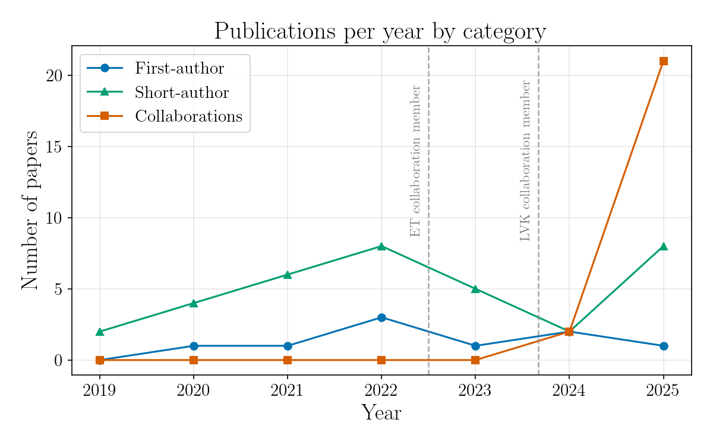

You can find an updated list of my pubblications in the [Astrophysics Data System](https://ui.adsabs.harvard.edu/search/q=%20%20author%3A%22santoliquido%2C%20filippo%22&sort=date%20desc%2C%20bibcode%20desc&p_=0)

<!--READ HERE WHENE UPDATING:-->
<!--Use this format in ADS custom export citation to print the list: *%T*, %h et al., %q %V(%S), %D, %U.\n-->

# Publication summary 

  

Number of publications per year (2019–2025), split into first-author papers, short-author-list papers, and large-collaboration papers. Dashed vertical lines mark the start of joint involvement in the Einstein Telescope collaboration (July 2022) and the LIGO–Virgo–KAGRA collaboration (September 2023).

<table>
  <tr>
    <td>Total publications</td>
    <td>87</td>
  </tr>
  <tr>
    <td>Total publications as first author</td>
    <td>10</td>
  </tr>
  <tr>
    <td>Refereed publications</td>
    <td>52</td>
  </tr>
  <tr>
    <td>Refereed publications as first author</td>
    <td>7</td>
  </tr>
  <tr>
    <td>Total number of citations</td>
    <td>5045</td>
  </tr>
  <tr>
    <td>Total number of citations as first author</td>
    <td>413</td>
  </tr>
  <tr>
    <td>h-index</td>
    <td>34</td>
  </tr>
  <tr>
    <td>h-index as first author</td>
    <td>6</td>
  </tr>
</table>

Last update: June 8, 2026

# 2026

*GWTC-5.0: An Introduction to Version 5.0 of the Gravitational-Wave Transient Catalog*, The LIGO Scientific Collaboration et al., arXiv 05/2026, <a href="https://ui.adsabs.harvard.edu/abs/2026arXiv260527223T">2026arXiv260527223T</a>.

*GW240925 and GW250207: Astrophysical Calibration of Gravitational-wave Detectors*, The LIGO Scientific Collaboration et al., arXiv 05/2026, <a href="https://ui.adsabs.harvard.edu/abs/2026arXiv260511703T">2026arXiv260511703T</a>.

*Searches for Binary Mergers with Sub-solar Mass Components in Data from the First Part of LIGO--Virgo--KAGRA's Fourth Observing Run*, The LIGO Scientific Collaboration et al., arXiv 05/2026, <a href="https://ui.adsabs.harvard.edu/abs/2026arXiv260505444T">2026arXiv260505444T</a>.

*Deep Search for Joint Sources of Gravitational Waves and High-energy Neutrinos with IceCube during the Third Observing Run of LIGO and Virgo*, Abbasi et al., ApJ 1003(1), 05/2026, <a href="https://ui.adsabs.harvard.edu/abs/2026ApJ..1003...41A">2026ApJ..1003...41A</a>.

*Comparing astrophysical models to gravitational-wave data in the observable space*, Toubiana et al., PhRvD 113(8), 04/2026, <a href="https://ui.adsabs.harvard.edu/abs/2026PhRvD.113h3006T">2026PhRvD.113h3006T</a>.

*All-sky search for long-duration gravitational-wave transients in the first part of the fourth LIGO-Virgo-KAGRA observing run*, Abac et al., PhRvD 113(8), 04/2026, <a href="https://ui.adsabs.harvard.edu/abs/2026PhRvD.113h2004A">2026PhRvD.113h2004A</a>.

*Comparing next-generation detector configurations for high-redshift gravitational wave sources with neural posterior estimation*, **Santoliquido et al.**, A&A 708 04/2026, <a href="https://ui.adsabs.harvard.edu/abs/2026A&A...708A.175S">2026A&A...708A.175S</a>.

*Narrowband searches for continuous gravitational waves from known pulsars in the first two parts of the fourth LIGO--Virgo--KAGRA observing run*, The LIGO Scientific Collaboration et al., arXiv 03/2026, <a href="https://ui.adsabs.harvard.edu/abs/2026arXiv260325938T">2026arXiv260325938T</a>.

*Searches for Continuous Gravitational Waves from Supernova Remnants in the first part of the LIGO-Virgo-KAGRA Fourth Observing run*, The LIGO Scientific Collaboration et al., arXiv 03/2026, <a href="https://ui.adsabs.harvard.edu/abs/2026arXiv260325808T">2026arXiv260325808T</a>.

*Isolated or Dynamical? Tracing Black Hole Binary Formation through the Population of Gravitational-Wave Sources*, Arca Sedda et al., arXiv 03/2026, <a href="https://ui.adsabs.harvard.edu/abs/2026arXiv260320430A">2026arXiv260320430A</a>.

*Advanced Virgo Plus for O5 -- Design Report Overview*, Acernese et al., arXiv 03/2026, <a href="https://ui.adsabs.harvard.edu/abs/2026arXiv260320342A">2026arXiv260320342A</a>.

*GWTC-4.0: Tests of General Relativity. III. Tests of the Remnants*, The LIGO Scientific Collaboration et al., arXiv 03/2026, <a href="https://ui.adsabs.harvard.edu/abs/2026arXiv260319021T">2026arXiv260319021T</a>.

*GWTC-4.0: Tests of General Relativity. II. Parameterized Tests*, The LIGO Scientific Collaboration et al., arXiv 03/2026, <a href="https://ui.adsabs.harvard.edu/abs/2026arXiv260319020T">2026arXiv260319020T</a>.

*GWTC-4.0: Tests of General Relativity. I. Overview and General Tests*, The LIGO Scientific Collaboration et al., arXiv 03/2026, <a href="https://ui.adsabs.harvard.edu/abs/2026arXiv260319019T">2026arXiv260319019T</a>.

*Calibrating spectral siren cosmology with synthetic catalogs of binary black hole mergers*, Scarpa et al., arXiv 03/2026, <a href="https://ui.adsabs.harvard.edu/abs/2026arXiv260315332S">2026arXiv260315332S</a>.

*All-sky Searches for Continuous Gravitational Waves from Isolated Neutron Stars in the Data from the First Part of the Fourth LIGO-Virgo-KAGRA Observing Run*, The LIGO Scientific Collaboration et al., arXiv 03/2026, <a href="https://ui.adsabs.harvard.edu/abs/2026arXiv260314168T">2026arXiv260314168T</a>.

*The Science of the Einstein Telescope*, Abac et al., JCAP 2026(3), 03/2026, <a href="https://ui.adsabs.harvard.edu/abs/2026JCAP...03..081A">2026JCAP...03..081A</a>.

*Constraining Binary Neutron Star Populations using Short Gamma-Ray Burst Observations*, De Santis et al., arXiv 02/2026, <a href="https://ui.adsabs.harvard.edu/abs/2026arXiv260213391D">2026arXiv260213391D</a>.

*Black Hole Spectroscopy and Tests of General Relativity with GW250114*, Abac et al., PhRvL 136(4), 01/2026, <a href="https://ui.adsabs.harvard.edu/abs/2026PhRvL.136d1403A">2026PhRvL.136d1403A</a>.

*Crystal Eye: All sky MeV monitor with high precision real-time localization*, Aloisio et al., APh 174 01/2026, <a href="https://ui.adsabs.harvard.edu/abs/2026APh...17403171A">2026APh...17403171A</a>.

# 2025

*WINK: Advancing X and Gamma Ray Detection Technology for Space Observations*, Tambone et al., icrc.conf 12/2025, <a href="https://ui.adsabs.harvard.edu/abs/2025icrc.confE.857T">2025icrc.confE.857T</a>.

*X-ray Binaries: A Key Corollary Science with Crystal Eye*, Tarana et al., icrc.conf 12/2025, <a href="https://ui.adsabs.harvard.edu/abs/2025icrc.confE.594T">2025icrc.confE.594T</a>.

*Constraints on gravitational waves from the 2024 Vela pulsar glitch*, The LIGO Scientific Collaboration et al., arXiv 12/2025, <a href="https://ui.adsabs.harvard.edu/abs/2025arXiv251217990T">2025arXiv251217990T</a>.

*Uncovering the population of compact binary mergers and their formation pathways with gravitational waves through the Einstein Telescope*, Arca-Sedda et al., arXiv 12/2025, <a href="https://ui.adsabs.harvard.edu/abs/2025arXiv251217339A">2025arXiv251217339A</a>.

*GWTC-4.0: Searches for Gravitational-Wave Lensing Signatures*, The LIGO Scientific Collaboration et al., arXiv 12/2025, <a href="https://ui.adsabs.harvard.edu/abs/2025arXiv251216347T">2025arXiv251216347T</a>.

*GWTC-4.0: An Introduction to Version 4.0 of the Gravitational-Wave Transient Catalog*, Abac et al., ApJL 995(1), 12/2025, <a href="https://ui.adsabs.harvard.edu/abs/2025ApJ...995L..18A">2025ApJ...995L..18A</a>.

*Black hole─neutron star and binary neutron star mergers from Population III and II stars*, Mestichelli et al., A&A 704 12/2025, <a href="https://ui.adsabs.harvard.edu/abs/2025A&A...704A..54M">2025A&A...704A..54M</a>.

*Search for planetary-mass ultra-compact binaries using data from the first part of the LIGO--Virgo--KAGRA fourth observing run*, The LIGO Scientific Collaboration et al., arXiv 11/2025, <a href="https://ui.adsabs.harvard.edu/abs/2025arXiv251119911T">2025arXiv251119911T</a>.

*All-sky search for continuous gravitational-wave signals from unknown neutron stars in binary systems in the first part of the fourth LIGO-Virgo-KAGRA observing run*, The LIGO Scientific Collaboration et al., arXiv 11/2025, <a href="https://ui.adsabs.harvard.edu/abs/2025arXiv251116863T">2025arXiv251116863T</a>.

*Fast and accurate parameter estimation of high-redshift sources with the Einstein Telescope*, **Santoliquido et al.**, PhRvD 112(10), 11/2025, <a href="https://ui.adsabs.harvard.edu/abs/2025PhRvD.112j3015S">2025PhRvD.112j3015S</a>.

*All-sky search for short gravitational-wave bursts in the first part of the fourth LIGO-Virgo-KAGRA observing run*, Abac et al., PhRvD 112(10), 11/2025, <a href="https://ui.adsabs.harvard.edu/abs/2025PhRvD.112j2005A">2025PhRvD.112j2005A</a>.

*GW231123: A Binary Black Hole Merger with Total Mass 190─265 M⊙*, Abac et al., ApJL 993(1), 11/2025, <a href="https://ui.adsabs.harvard.edu/abs/2025ApJ...993L..25A">2025ApJ...993L..25A</a>.

*GW241011 and GW241110: Exploring Binary Formation and Fundamental Physics with Asymmetric, High-spin Black Hole Coalescences*, Abac et al., ApJL 993(1), 11/2025, <a href="https://ui.adsabs.harvard.edu/abs/2025ApJ...993L..21A">2025ApJ...993L..21A</a>.

*Direct multi-model dark-matter search with gravitational-wave interferometers using data from the first part of the fourth LIGO-Virgo-KAGRA observing run*, The LIGO Scientific Collaboration et al., arXiv 10/2025, <a href="https://ui.adsabs.harvard.edu/abs/2025arXiv251027022T">2025arXiv251027022T</a>.

*Cosmological and High Energy Physics implications from gravitational-wave background searches in LIGO-Virgo-KAGRA's O1-O4a runs*, The LIGO Scientific Collaboration et al., arXiv 10/2025, <a href="https://ui.adsabs.harvard.edu/abs/2025arXiv251026848T">2025arXiv251026848T</a>.

*Directional Search for Persistent Gravitational Waves: Results from the First Part of LIGO-Virgo-KAGRA's Fourth Observing Run*, The LIGO Scientific Collaboration et al., arXiv 10/2025, <a href="https://ui.adsabs.harvard.edu/abs/2025arXiv251017487T">2025arXiv251017487T</a>.

*Directed searches for gravitational waves from ultralight vector boson clouds around merger remnant and galactic black holes during the first part of the fourth LIGO-Virgo-KAGRA observing run*, The LIGO Scientific Collaboration et al., arXiv 09/2025, <a href="https://ui.adsabs.harvard.edu/abs/2025arXiv250907352T">2025arXiv250907352T</a>.

*GWTC-4.0: Constraints on the Cosmic Expansion Rate and Modified Gravitational-wave Propagation*, The LIGO Scientific Collaboration et al., arXiv 09/2025, <a href="https://ui.adsabs.harvard.edu/abs/2025arXiv250904348T">2025arXiv250904348T</a>.

*GW250114: Testing Hawking's Area Law and the Kerr Nature of Black Holes*, Abac et al., PhRvL 135(11), 09/2025, <a href="https://ui.adsabs.harvard.edu/abs/2025PhRvL.135k1403A">2025PhRvL.135k1403A</a>.

*Upper Limits on the Isotropic Gravitational-Wave Background from the first part of LIGO, Virgo, and KAGRA's fourth Observing Run*, The LIGO Scientific Collaboration et al., arXiv 08/2025, <a href="https://ui.adsabs.harvard.edu/abs/2025arXiv250820721T">2025arXiv250820721T</a>.

*GWTC-4.0: Population Properties of Merging Compact Binaries*, The LIGO Scientific Collaboration et al., arXiv 08/2025, <a href="https://ui.adsabs.harvard.edu/abs/2025arXiv250818083T">2025arXiv250818083T</a>.

*GWTC-4.0: Updating the Gravitational-Wave Transient Catalog with Observations from the First Part of the Fourth LIGO-Virgo-KAGRA Observing Run*, The LIGO Scientific Collaboration et al., arXiv 08/2025, <a href="https://ui.adsabs.harvard.edu/abs/2025arXiv250818082T">2025arXiv250818082T</a>.

*GWTC-4.0: Methods for Identifying and Characterizing Gravitational-wave Transients*, The LIGO Scientific Collaboration et al., arXiv 08/2025, <a href="https://ui.adsabs.harvard.edu/abs/2025arXiv250818081T">2025arXiv250818081T</a>.

*Open Data from LIGO, Virgo, and KAGRA through the First Part of the Fourth Observing Run*, The LIGO Scientific Collaboration et al., arXiv 08/2025, <a href="https://ui.adsabs.harvard.edu/abs/2025arXiv250818079T">2025arXiv250818079T</a>.

*Search for Gravitational Waves Emitted from SN 2023ixf*, Abac et al., ApJ 985(2), 06/2025, <a href="https://ui.adsabs.harvard.edu/abs/2025ApJ...985..183A">2025ApJ...985..183A</a>.

*The more accurately the metal-dependent star formation rate is modeled, the larger the predicted excess of binary black hole mergers*, Sgalletta et al., A&A 698 06/2025, <a href="https://ui.adsabs.harvard.edu/abs/2025A&A...698A.144S">2025A&A...698A.144S</a>.

*Prospects for optical detections from binary neutron star mergers with the next-generation multi-messenger observatories*, Loffredo et al., A&A 697 05/2025, <a href="https://ui.adsabs.harvard.edu/abs/2025A&A...697A..36L">2025A&A...697A..36L</a>.

*Search for Continuous Gravitational Waves from Known Pulsars in the First Part of the Fourth LIGO-Virgo-KAGRA Observing Run*, Abac et al., ApJ 983(2), 04/2025, <a href="https://ui.adsabs.harvard.edu/abs/2025ApJ...983...99A">2025ApJ...983...99A</a>.

*A new prescription for the spectral properties of population III stellar populations*, Lecroq et al., A&A 695 03/2025, <a href="https://ui.adsabs.harvard.edu/abs/2025A&A...695A..17L">2025A&A...695A..17L</a>.

*Validating prior-informed Fisher-matrix analyses against GWTC data*, Dupletsa et al., PhRvD 111(2), 01/2025, <a href="https://ui.adsabs.harvard.edu/abs/2025PhRvD.111b4036D">2025PhRvD.111b4036D</a>.

# 2024

*A Search Using GEO600 for Gravitational Waves Coincident with Fast Radio Bursts from SGR 1935+2154*, Abac et al., ApJ 977(2), 12/2024, <a href="https://ui.adsabs.harvard.edu/abs/2024ApJ...977..255A">2024ApJ...977..255A</a>.

*Gravitational waves from mergers of Population III binary black holes: roles played by two evolution channels*, Liu et al., MNRAS 534(3), 11/2024, <a href="https://ui.adsabs.harvard.edu/abs/2024MNRAS.534.1634L">2024MNRAS.534.1634L</a>.

*Classifying binary black holes from Population III stars with the Einstein Telescope: A machine-learning approach*, **Santoliquido et al.**, A&A 690 10/2024, <a href="https://ui.adsabs.harvard.edu/abs/2024A&A...690A.362S">2024A&A...690A.362S</a>.

*Binary black hole mergers from Population III star clusters*, Mestichelli et al., A&A 690 10/2024, <a href="https://ui.adsabs.harvard.edu/abs/2024A&A...690A.106M">2024A&A...690A.106M</a>.

*Observation of Gravitational Waves from the Coalescence of a 2.5─4.5 M ⊙ Compact Object and a Neutron Star*, Abac et al., ApJL 970(2), 08/2024, <a href="https://ui.adsabs.harvard.edu/abs/2024ApJ...970L..34A">2024ApJ...970L..34A</a>.

*Correction to: Binary black hole mergers from population III stars: uncertainties from star formation and binary star properties*, **Santoliquido et al.**, MNRAS 528(1), 02/2024, <a href="https://ui.adsabs.harvard.edu/abs/2024MNRAS.528..954S">2024MNRAS.528..954S</a>.

# 2023

*Binary Black Hole Spins: Model Selection with GWTC-3*, Périgois et al., Univ 9(12), 12/2023, <a href="https://ui.adsabs.harvard.edu/abs/2023Univ....9..507P">2023Univ....9..507P</a>.

*Massive binary black holes from Population II and III stars*, Costa et al., MNRAS 525(2), 10/2023, <a href="https://ui.adsabs.harvard.edu/abs/2023MNRAS.525.2891C">2023MNRAS.525.2891C</a>.

*Pre-merger alert to detect prompt emission in very-high-energy gamma-rays from binary neutron star mergers: Einstein Telescope and Cherenkov Telescope Array synergy*, Banerjee et al., A&A 678 10/2023, <a href="https://ui.adsabs.harvard.edu/abs/2023A&A...678A.126B">2023A&A...678A.126B</a>.

*Compact object mergers: exploring uncertainties from stellar and binary evolution with SEVN*, Iorio et al., MNRAS 524(1), 09/2023, <a href="https://ui.adsabs.harvard.edu/abs/2023MNRAS.524..426I">2023MNRAS.524..426I</a>.

*Binary black hole mergers from population III stars: uncertainties from star formation and binary star properties*, **Santoliquido et al.**, MNRAS 524(1), 09/2023, <a href="https://ui.adsabs.harvard.edu/abs/2023MNRAS.524..307S">2023MNRAS.524..307S</a>.

*Science with the Einstein Telescope: a comparison of different designs*, Branchesi et al., JCAP 2023(7), 07/2023, <a href="https://ui.adsabs.harvard.edu/abs/2023JCAP...07..068B">2023JCAP...07..068B</a>.

# 2022

*Modelling the host galaxies of binary compact object mergers with observational scaling relations*, **Santoliquido et al.**, MNRAS 516(3), 11/2022, <a href="https://ui.adsabs.harvard.edu/abs/2022MNRAS.516.3297S">2022MNRAS.516.3297S</a>.

*Perspectives for multimessenger astronomy with the next generation of gravitational-wave detectors and high-energy satellites*, Ronchini et al., A&A 665 09/2022, <a href="https://ui.adsabs.harvard.edu/abs/2022A&A...665A..97R">2022A&A...665A..97R</a>.

*Erratum: Prospects for multimessenger detection of binary neutron star mergers in the fourth LIGO-Virgo-KAGRA observing run*, Patricelli et al., MNRAS 514(3), 08/2022, <a href="https://ui.adsabs.harvard.edu/abs/2022MNRAS.514.3395P">2022MNRAS.514.3395P</a>.

*The evolution of compact object mergers and their host galaxies across cosmic time*, **Santoliquido et al.**, eas..conf 07/2022, <a href="https://ui.adsabs.harvard.edu/abs/2022eas..conf..294S">2022eas..conf..294S</a>.

*Prospects for multi-messenger detection of binary neutron star mergers in the fourth LIGO-Virgo-KAGRA observing run*, Patricelli et al., eas..conf 07/2022, <a href="https://ui.adsabs.harvard.edu/abs/2022eas..conf..146P">2022eas..conf..146P</a>.

*Prospects for multimessenger detection of binary neutron star mergers in the fourth LIGO-Virgo-KAGRA observing run*, Patricelli et al., MNRAS 513(3), 07/2022, <a href="https://ui.adsabs.harvard.edu/abs/2022MNRAS.513.4159P">2022MNRAS.513.4159P</a>.

*Gravitational background from dynamical binaries and detectability with 2G detectors*, Périgois et al., PhRvD 105(10), 05/2022, <a href="https://ui.adsabs.harvard.edu/abs/2022PhRvD.105j3032P">2022PhRvD.105j3032P</a>.

*Host galaxies and electromagnetic counterparts to binary neutron star mergers across the cosmic time: detectability of GW170817-like events*, Perna et al., MNRAS 512(2), 05/2022, <a href="https://ui.adsabs.harvard.edu/abs/2022MNRAS.512.2654P">2022MNRAS.512.2654P</a>.

*The cosmic evolution of binary black holes in young, globular, and nuclear star clusters: rates, masses, spins, and mixing fractions*, Mapelli et al., MNRAS 511(4), 04/2022, <a href="https://ui.adsabs.harvard.edu/abs/2022MNRAS.511.5797M">2022MNRAS.511.5797M</a>.

*The evolution of compact object mergers and their host galaxies across cosmic time*, **Santoliquido et al.**, APS..APRD 2022 04/2022, <a href="https://ui.adsabs.harvard.edu/abs/2022APS..APRD15008S">2022APS..APRD15008S</a>.

*Compact object mergers in hierarchical triples from low-mass young star clusters*, Trani et al., MNRAS 511(1), 02/2022, <a href="https://ui.adsabs.harvard.edu/abs/2022MNRAS.511.1362T">2022MNRAS.511.1362T</a>.

# 2021

*GW190521 formation via three-body encounters in young massive star clusters*, Dall'Amico et al., MNRAS 508(2), 12/2021, <a href="https://ui.adsabs.harvard.edu/abs/2021MNRAS.508.3045D">2021MNRAS.508.3045D</a>.

*New insights on binary black hole formation channels after GWTC-2: young star clusters versus isolated binaries*, Bouffanais et al., MNRAS 507(4), 11/2021, <a href="https://ui.adsabs.harvard.edu/abs/2021MNRAS.507.5224B">2021MNRAS.507.5224B</a>.

*Dynamics of binary black holes in low-mass young star clusters*, Rastello et al., MNRAS 507(3), 11/2021, <a href="https://ui.adsabs.harvard.edu/abs/2021MNRAS.507.3612R">2021MNRAS.507.3612R</a>.

*Mass and Rate of Hierarchical Black Hole Mergers in Young, Globular and Nuclear Star Clusters*, Mapelli et al., Symm 13(9), 09/2021, <a href="https://ui.adsabs.harvard.edu/abs/2021Symm...13.1678M">2021Symm...13.1678M</a>.

*Constraining accretion efficiency in massive binary stars with LIGO -Virgo black holes*, Bouffanais et al., MNRAS 505(3), 08/2021, <a href="https://ui.adsabs.harvard.edu/abs/2021MNRAS.505.3873B">2021MNRAS.505.3873B</a>.

*Hierarchical black hole mergers in young, globular and nuclear star clusters: the effect of metallicity, spin and cluster properties*, Mapelli et al., MNRAS 505(1), 07/2021, <a href="https://ui.adsabs.harvard.edu/abs/2021MNRAS.505..339M">2021MNRAS.505..339M</a>.

*The cosmic merger rate density of compact objects: impact of star formation, metallicity, initial mass function, and binary evolution*, **Santoliquido et al.**, MNRAS 502(4), 04/2021, <a href="https://ui.adsabs.harvard.edu/abs/2021MNRAS.502.4877S">2021MNRAS.502.4877S</a>.

# 2020

*Binary black holes in young star clusters: the impact of metallicity*, Di Carlo et al., MNRAS 498(1), 10/2020, <a href="https://ui.adsabs.harvard.edu/abs/2020MNRAS.498..495D">2020MNRAS.498..495D</a>.

*Dynamics of black hole-neutron star binaries in young star clusters*, Rastello et al., MNRAS 497(2), 09/2020, <a href="https://ui.adsabs.harvard.edu/abs/2020MNRAS.497.1563R">2020MNRAS.497.1563R</a>.

*Binary black holes in the pair instability mass gap*, Di Carlo et al., MNRAS 497(1), 09/2020, <a href="https://ui.adsabs.harvard.edu/abs/2020MNRAS.497.1043D">2020MNRAS.497.1043D</a>.

*The Cosmic Merger Rate Density Evolution of Compact Binaries Formed in Young Star Clusters and in Isolated Binaries*, **Santoliquido et al.**, ApJ 898(2), 08/2020, <a href="https://ui.adsabs.harvard.edu/abs/2020ApJ...898..152S">2020ApJ...898..152S</a>.

*An astrophysically motivated ranking criterion for low-latency electromagnetic follow-up of gravitational wave events*, Artale et al., MNRAS 495(2), 06/2020, <a href="https://ui.adsabs.harvard.edu/abs/2020MNRAS.495.1841A">2020MNRAS.495.1841A</a>.

# 2019

*Host galaxies of merging compact objects: mass, star formation rate, metallicity, and colours*, Artale et al., MNRAS 487(2), 08/2019, <a href="https://ui.adsabs.harvard.edu/abs/2019MNRAS.487.1675A">2019MNRAS.487.1675A</a>.

*The properties of merging black holes and neutron stars across cosmic time*, Mapelli et al., MNRAS 487(1), 07/2019, <a href="https://ui.adsabs.harvard.edu/abs/2019MNRAS.487....2M">2019MNRAS.487....2M</a>.

