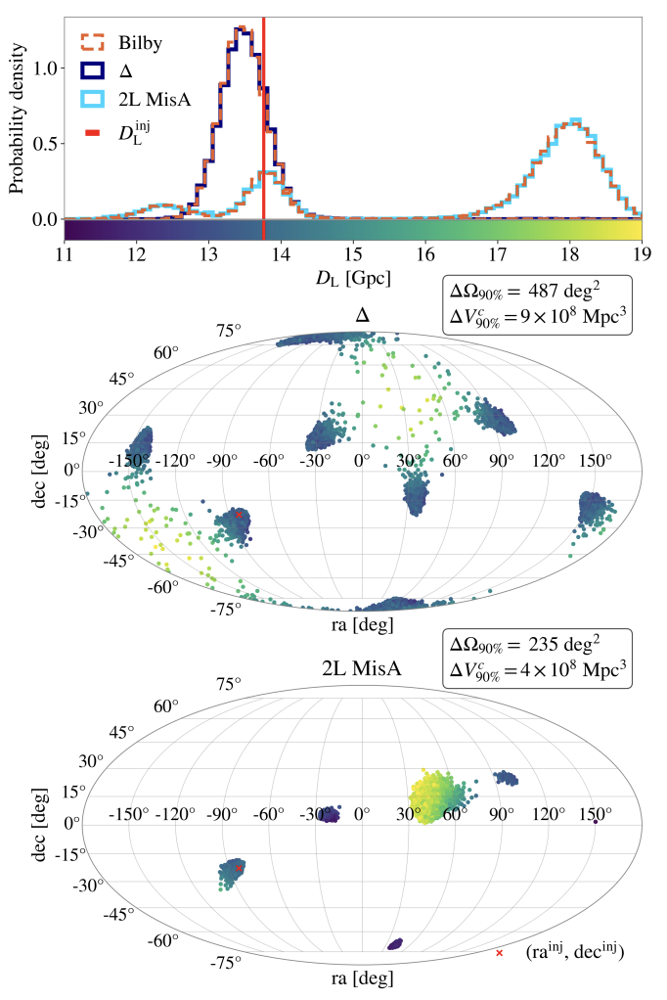
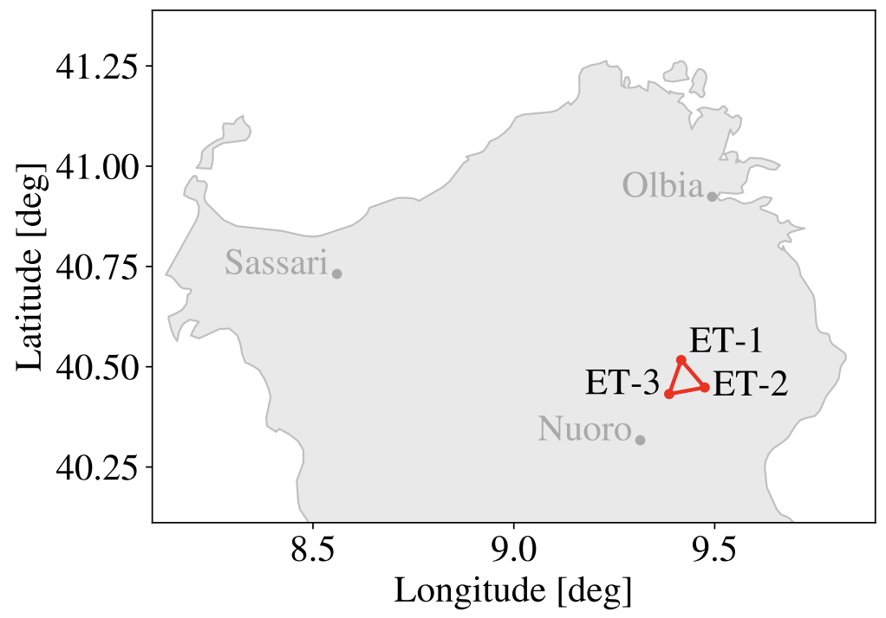
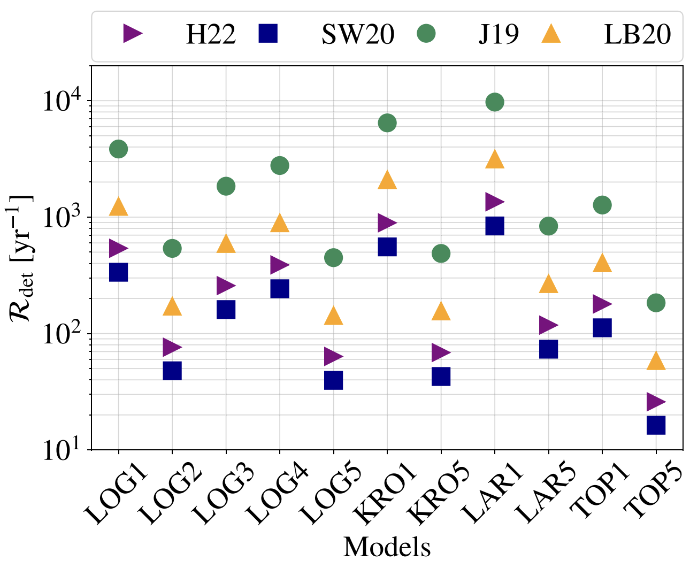
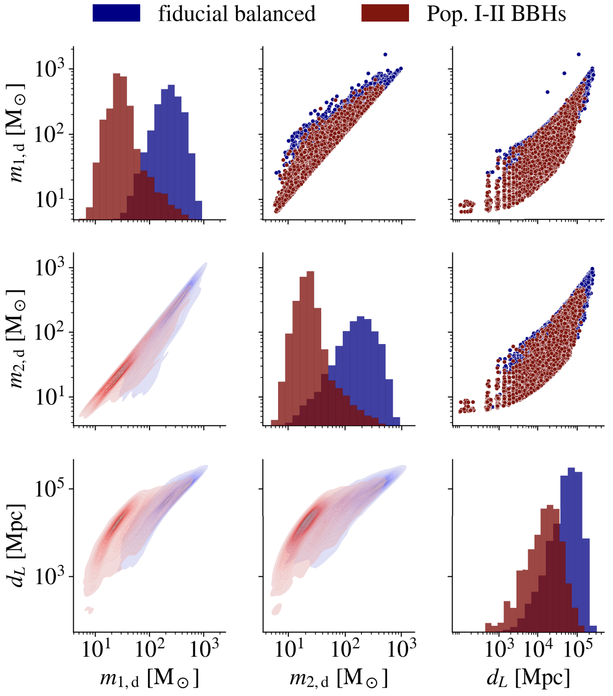

Below I outline my research interests — feel free to [reach out](mailto:filippo.santoliquido@gssi.it) for further details.

## Deep Learning applied to Gravitational Wave astrophysics

The next decade will decide the final design of the next-generation gravitational-wave observatories, such as the [Einstein Telescope](https://www.et-gw.eu/) and [Cosmic Explorer](https://cosmicexplorer.org/). These choices — the geometry, orientation, and location of the detectors — are essentially irreversible, so it is crucial to understand how each option shapes the science we will be able to do. [In this paper](https://arxiv.org/pdf/2512.20699), we compared several candidate configurations and asked a simple question: how well can each of them measure the properties of the gravitational-wave sources we care about most?

We focused on a particularly promising class of sources: massive black hole mergers from the distant Universe, including those formed by the first generation of stars, primordial black holes, and intermediate-mass black holes. To analyze them, we used [Dingo](https://github.com/dingo-gw/dingo), a fast deep-learning method based on normalizing flows, which reconstructs the properties of a source in minutes rather than the many hours required by traditional approaches — an essential feature given the enormous number of detections expected with future observatories.

A key result is that two misaligned L-shaped detectors generally pinpoint the position of a source on the sky, and its location in the Universe, better than a single triangular detector. This improvement is important for cosmology, where identifying the galaxies that may host a source depends on how well we can localize it. The figure below shows one illustrative event analyzed with two different configurations.

<figure style="width: 70%; margin: 0 auto;">
  
  <figcaption style="font-size: 0.85em; text-align: left;">Reconstruction of a single black hole merger observed with a triangular detector ($\Delta$, dark blue) and with two misaligned L-shaped detectors (2L MisA, light blue), compared with a standard analysis (orange). The top panel shows the inferred distance to the source, while the lower panels show its position on the sky, color-coded by distance. The 2L MisA configuration produces fewer distinct sky regions, leading to a more precise localization. Adapted from <a href="https://arxiv.org/abs/2512.20699">Santoliquido et al. 2026</a>.</figcaption>
</figure>

## Einstein Telescope science case

<figure style="width: 70%; margin: 0 auto;">
  
  <figcaption style="font-size: 0.85em; text-align: left;">Position and orientation of the three nested interferometers (ET-1, ET-2, and ET-3) that together form the triangular Einstein Telescope (ET-$\Delta$), shown here at the candidate site in Sardinia. Adapted from <a href="https://arxiv.org/abs/2504.21087">Santoliquido et al. 2025</a>.</figcaption>
</figure>

The [Einstein Telescope](https://www.et-gw.eu/) is a third-generation gravitational-wave detector designed to be built underground, shielding it from numerous noise sources. Thanks to its unprecedented sensitivity, it will observe black hole mergers from across the deep Universe. As part of this effort, I have been investigating the population of sources the Einstein Telescope will detect, including [black holes formed from Population III stars](https://arxiv.org/pdf/2303.15515) — the very first generation of stars to have ever formed. While the Einstein Telescope will be able to observe these sources, their expected number depends sensitively on a range of poorly constrained astrophysical processes, as illustrated in the figure below.

<figure style="width: 70%; margin: 0 auto;">
  
  <figcaption style="font-size: 0.85em; text-align: left;">Detection rate $\mathcal{R}_\mathrm{det}$ of binary black holes formed from Population III stars, assuming the Einstein Telescope in its triangle configuration. Different colors and marker shapes correspond to different models for star formation in the early Universe, while the $x$-axis labels the different binary evolution pathways leading to black hole formation. Adapted from <a href="https://arxiv.org/abs/2303.15515">Santoliquido et al. 2023</a>.</figcaption>
</figure>

## Machine Learning applied to Astrophysics

Machine learning is opening new frontiers in astrophysics. [In this paper](https://arxiv.org/pdf/2404.10048), I used [XGBoost](https://xgboost.readthedocs.io/en/stable/index.html) to classify two distinct black hole populations: high-redshift sources formed in the distant Universe, and those originating in nearby galaxies. Detecting high-redshift sources will be one of the key science goals of the [Einstein Telescope](https://www.et-gw.eu/), a next-generation gravitational-wave observatory.

<figure style="width: 70%; margin: 0 auto;">
  
  <figcaption style="font-size: 0.85em; text-align: left;">Red and blue distributions correspond to binary black hole mergers from the most recent generations of stars (Pop. I-II BBHs) and the distant Universe (fiducial balanced), respectively. The lower panels show kernel density estimates of the source parameters (masses and distance), the upper panels the individual samples, and the diagonal panels the marginalized distributions. Adapted from <a href="https://arxiv.org/abs/2404.10048">Santoliquido et al. 2024</a>.</figcaption>
</figure>

## Black hole mergers across cosmic time

This topic forms the core of <a href="https://filippo-santoliquido.github.io/assets/images/PhD_Thesis_Santoliquido_R.pdf">my PhD thesis</a>, where I investigated how black hole mergers evolve over cosmic time. Specifically, I examined the expected number of black hole mergers at various distances from Earth, including those in the high-redshift Universe. This work is crucial for preparing the science case for the Einstein Telescope. To approach this, I considered two formation channels for black holes:

### Isolated formation channel   	
Black holes can form directly from the evolution of massive stars. For two black holes to merge, they need to be part of the same binary system. These systems, known as field binaries, exist in nature. Black holes formed this way are said to have generated from the isolated formation channel. <a href="https://arxiv.org/pdf/2009.03911">In this paper</a>, I analyzed the physical processes during binary evolution that influence the total number of merging black holes.
	
	

### Dynamical formation channel   	
The isolated formation channel is not the only mechanism for black hole formation. Dynamical interactions between stars can also lead to black hole mergers. <a href="https://arxiv.org/pdf/2004.09533">In this paper</a>, I compared this dynamical formation channel with the isolated one to assess their relative contributions.

## Constraining models with observations

Constraining theory with observations is a fundamental aspect of the scientific method, and this is equally true in gravitational-wave astrophysics. A key feature of our approach is the use of hierarchical Bayesian analysis. <a href="https://arxiv.org/pdf/1905.11054">In this paper</a>, we investigated the number of black holes formed through the isolated and the dynamical formation channels by analyzing observational data.  

## Host galaxies of black holes and neutron stars

When two black holes or two neutron stars merge, it typically occurs within a specific galaxy, as both black holes and neutron stars are formed inside galaxies. <a href="https://ui.adsabs.harvard.edu/abs/2022MNRAS.516.3297S/abstract">In this paper</a>, I investigated the relationship between the physical processes that shape galaxy properties and the massive stars in binary systems. Studying this relationship is challenging due to the large scales involved. I needed to connect phenomena occurring at the galactic scale with those at the level of individual stars. Despite the complexity, understanding the host galaxies is crucial. It reveals how the properties of black holes and neutron stars are connected to the evolution of the Universe, highlighting the importance of gravitational waves as a tool for exploring our cosmos.

<!--
Here, I outline my research interests. Click on each item to explore further details.

Machine Learning applied to Astrophysics

Machine Learning represents an important step forward in advanicng many astrophycs task. <a href="https://arxiv.org/pdf/2404.10048">In this paper</a>, we used <a href="https://xgboost.readthedocs.io/en/stable/index.html">XGBoost</a> to learn how to classify two different populations of black holes: Those generated in the distant Universe and those generated in close-by galaxies. Distant black holes will be observed by the <a href="https://www.et-gw.eu/">Einstein Telescope</a>: A third-generation detector for observing gravitaitonal-waves. 

Development of the Einstein Telescope science case

The <a href="https://www.et-gw.eu/">Einstein Telescope</a> is a third-generation gravitational-wave detector designed to be built underground. It will enable us to observe black hole mergers from deep space. To prepare for this, I have begun investigating the potential sources that the Einstein Telescope will detect, including <a href="https://arxiv.org/pdf/2303.15515">black holes formed from Population III stars</a>, the first generation of stars ever created.

Black hole mergers across cosmic time

This topic forms the core of <a href="https://filippo-santoliquido.github.io/assets/images/PhD_Thesis_Santoliquido_R.pdf">my PhD thesis</a>, where I investigated how black hole mergers evolve over cosmic time. Specifically, I examined the expected number of black hole mergers at various distances from Earth, including those in the high-redshift Universe. This work is crucial for preparing the science case for the Einstein Telescope. To approach this, I considered two formation channels for black holes:

   

	

  	
 Isolated formation channel 

  	

	Black holes can form directly from the evolution of massive stars. For two black holes to merge, they need to be part of the same binary system. These systems, known as field binaries, exist in nature. Black holes formed this way are said to have generated from the isolated formation channel. <a href="https://arxiv.org/pdf/2009.03911">In this paper</a>, I analyzed the physical processes during binary evolution that influence the total number of merging black holes.
	
	

	

	

	

  	
 Dynamical formation channel 

  	

	The isolated formation channel is not the only mechanism for black hole formation. Dynamical interactions between stars can also lead to black hole mergers. <a href="https://arxiv.org/pdf/2004.09533">In this paper</a>, I compared this dynamical formation channel with the isolated one to assess their relative contributions.

	
	

	

Constraining models with observations

Constraining theory with observations is a fundamental aspect of the scientific method, and this is equally true in gravitational-wave astrophysics. A key feature of our approach is the use of hierarchical Bayesian analysis. <a href="https://arxiv.org/pdf/1905.11054">In this paper</a>, we investigated the number of black holes formed through the isolated and the dynamical formation channels by analyzing observational data.  

Host galaxies of black holes and neutron stars

When two black holes or two neutron stars merge, it typically occurs within a specific galaxy, as both black holes and neutron stars are formed inside galaxies. <a href="https://ui.adsabs.harvard.edu/abs/2022MNRAS.516.3297S/abstract">In this paper</a>, I investigated the relationship between the physical processes that shape galaxy properties and the massive stars in binary systems. Studying this relationship is challenging due to the large scales involved. I needed to connect phenomena occurring at the galactic scale with those at the level of individual stars. Despite the complexity, understanding the host galaxies is crucial. It reveals how the properties of black holes and neutron stars are connected to the evolution of the Universe, highlighting the importance of gravitational waves as a tool for exploring our cosmos.

 -->

