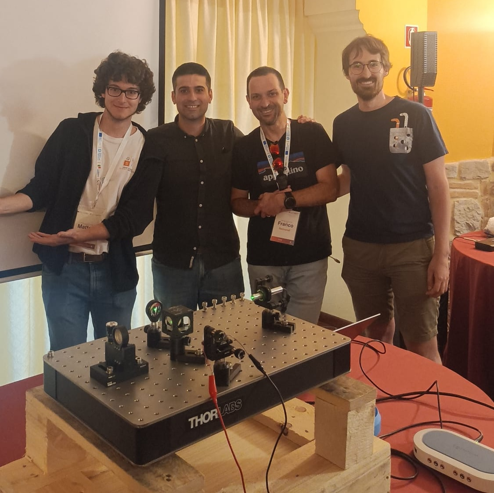

# Teaching and Mentoring

## Teaching

* May 2026, **Foundations of Gravitational-Wave and Multimessenger Astrophysics** (GC-9). I taught a course on gravitational-wave data analysis to the PhD students of the 41st cycle in Astroparticle Physics at GSSI. The course covered the main approaches, from the Fisher information matrix approximation, to the full Bayesian inference problem, to deep-learning-based methods for fast inference. Each lecture was followed by a hands-on session on using the codes [`GWFish`](https://gwfish.readthedocs.io/en/latest/), [`Bilby`](https://bilby-dev.github.io/bilby/index.html), and [`Dingo`](https://dingo-gw.readthedocs.io/en/latest/). Teaching material available [here](https://drive.google.com/drive/folders/169fBDyvdkjaMZyPF9Zwi3KIAQgEWo_UX){: .btn--research} upon request (6 hours).

## Invited lecturer

* Mar. 23, 2026, **Hands-on session on Bayesian inference**. I gave a lecture on using `Bilby` for standard inference problems, with a worked example on simplified gravitational-wave data analysis. The lecture was part of the course "Probabilistic Inference and Forecasting in the Sciences", held by Dr. Stefano Piacentini for the first-year PhD students in Physics at Sapienza University of Rome. Material available [here](https://github.com/filippo-santoliquido/hands-on_bayesian_inference){: .btn--research}. (2 hours)

* Aug. 6, 2024, **Hands-on section on cosmo$\mathcal{R}$ate**. Click [here](/chile/){: .btn--research} to access lecture material. Universidad Andrés Bello, Santiago, Chile. (2 hours)

* Aug. 2024, **Lecturer of the course "Gravitational Wave Astrophysics" during the school "Cosmological History: from Gravitational Waves to Exoplanets"**. Click [here](/Brazil/){: .btn--research} to access lecture material. [ICTP-SAIFR](https://www.ictp-saifr.org/)/[IFT-UNESP](https://www.ift.unesp.br/), São Paulo, Brazil. (4 hours + hands-on sections)

## Teaching assistant

* Nov. 2021, **Physics Lab assistant**. I supported students during learning of basic programming skills for data analysis in C++. Univeristy of Padova, Italy. (20 hours)

* Jun. 2021, **Laboratory of Computational Astrophysics**. I tutored a group of three students that completed a project using [cosmo$\mathcal{R}$ate](https://filippo-santoliquido.github.io/software/#cosmomathcalrate){: .btn--research}. Univeristy of Padova, Italy. (12 hours)

* Nov. 2020, **Physics Lab assistant**. I supported students learning basic programming skills for data analysis in C++. Univeristy of Padova, Italy. (20 hours)

## Mentoring

* Co-supervisor of **PhD thesis**:
  
  * Ludovico Alessio De Santis, _Gran Sasso Science Institute_, expected PhD defence Dec. 2026
  
  * Mirko Pitzalis, _University of Cagliari_, expected PhD defence Dec. 2026

* Co-supervisor of **master thesis**:
  
  * Mar. 2022, **Lorenzo Merli**, _University of Padova_. Lorenzo looked at the evolution of the properties of Population III stars that can generate merging binary black holes at high redshift. 
  
  * Dec. 2021, **Roberta Rufolo**, _University of Padova_. Roberta explored the impact of various prescritpions modelling the spin distributions of binary black holes detectable with LIGO-Virgo inteferometers. My main task was to guide her through the various functionalities of our codes.

# Outreach

* June 11, 2026, [**Space and Stars** GSSI outreach programme in collaboration with Scuola Superiore Meridionale](https://www.gssi.it/seminars/seminars-and-events-2026/item/26231-stelle-e-spazio-orientamento-al-gssi). Fifty high-school students selected from across Italy visited GSSI. Together with Dr. Cristiano Ugolini and Matteo Schulz, I gave a hands-on outreach lecture on the basics of gravitational-wave detection with a Michelson interferometer. 

<figure style="width: 70%; margin: 0 auto;">
  
  <figcaption style="font-size: 0.85em; text-align: left;">Demonstrating the basics of gravitational-wave detection with a Michelson interferometer kit during the "Space and Stars" outreach programme at GSSI. From left to right: Matteo Ballelli, Filippo Santoliquido, Prof. Franco Raimondi (event organiser) and Matteo Schulz.</figcaption>
</figure>

* May 30, 2026, [**Periferie creative**](https://www.gssi.it/seminars/seminars-and-events-2026/item/26194-periferie-creative), a project organized by the [Orbeat collective](https://www.instagram.com/orbeat.collective/) and GSSI, aimed at regenerating local urban spaces such as neighborhood parks into inclusive, participatory places. As part of the event, we brought a solar telescope and a Michelson interferometer to introduce the basics of gravitational-wave detection.

* Nov. 24-29, 2025, lecture on gravitational-wave astrophysics as part of a teacher training program (Programma INFN per Docenti, PID), _LNGS_, L'Aquila, Italy.

* May 12, 2025, [**Space Explorer**](https://www.laquilablog.it/lastrofisica-marica-branchesi-incontra-gli-studenti-della-scuola-gianni-di-genova/) – an outreach activity dedicated to the youngest astro-curious students at “Gianni Di Genova” Elementary School, L’Aquila, Italy.

* Sep 27, 2024, **volunteer at [SHARPER24](https://www.sharper-night.it/sharper-laquila/)**

* Sep. 19, 2024, **Tutte le direzioni della luce**. The stunning island of [Sant'Antioco](https://maps.app.goo.gl/tmPRmhxjFFqv5B1d9) provided the perfect setting for our discussions on the [Sun](/assets/images/SantAntioco/SantAntioco_sole.pdf) and [Moon](/assets/images/SantAntioco/SantAntioco_luna.pdf). The event was organised by [Ottovolante Sulcis](https://ottovolantesulcis.it/) in collaboration with [IDeAS](https://linktr.ee/ideas_1794). 

    

* **Outreach lectures** on Physics and Astrophysics to high school classes:
  
  * Mar. 25, 2024, "Alessandro Volta" high school, Pescara, Italy
  * Jan. 25, 2024, "Albert Einstein" high school, Teramo, Italy

* An outreach article presenting the research I conducted during my PhD was published in the [Giornale di Astronomia, Vol. 50](https://giornaleastronomia.difa.unibo.it/). <!-- You can donwloand a [copy](/assets/images/premioTacchini23.pdf) of this article *(only in Italian)*.-->  

* Sep. 29, 2023, **volunteer at [SHARPER23](https://www.sharper-night.it/sharper-laquila/)** 

<figure style="width: 70%; margin: 0 auto;">
  
  <figcaption style="font-size: 0.85em; text-align: left;">Everything ready for the kilonova esperiment 🤩</figcaption>
</figure>

* Nov. 27, 2020, **Night of Researchers**. The 2020 Night of Researchers was followed by more than 500 people. I briefly introduced the gravitational wave topic and gave some short updates of my research work. At this [link](https://www.youtube.com/watch?v=aA_X20AdT0s){: .btn--research} you can find the full recording. 

* Oct. 2018 - Mar. 2020, **Guide for the Museum of History of Physics**. I have been a guide for the [Museum of History of Physics](https://www.musei.unipd.it/en/physics) of the University of Padova. The visits were meant for both elementary and high school students
